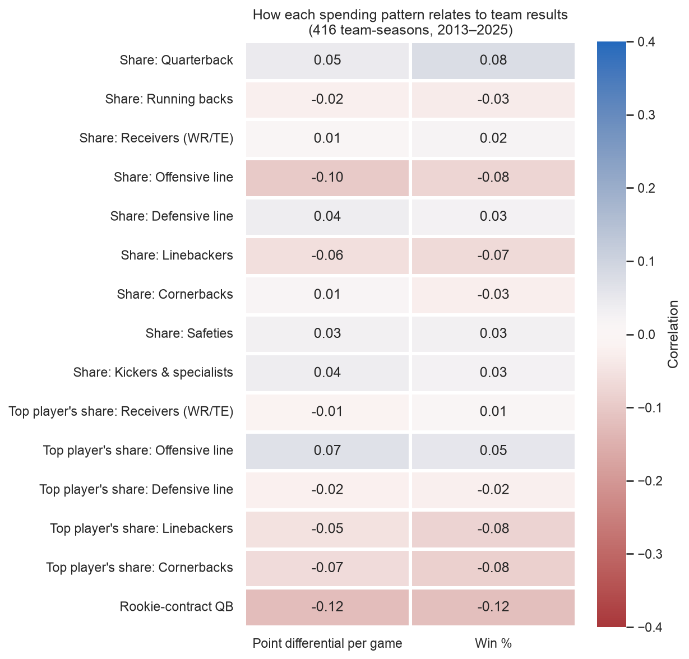
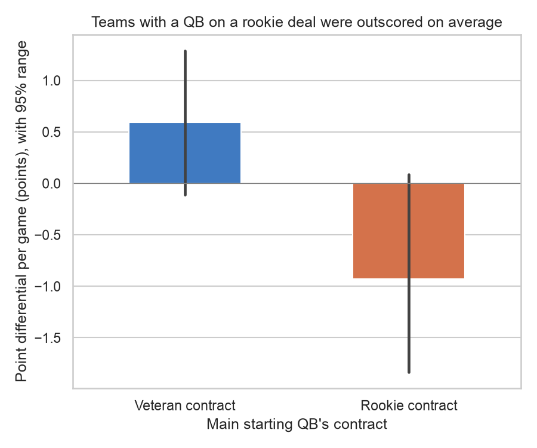
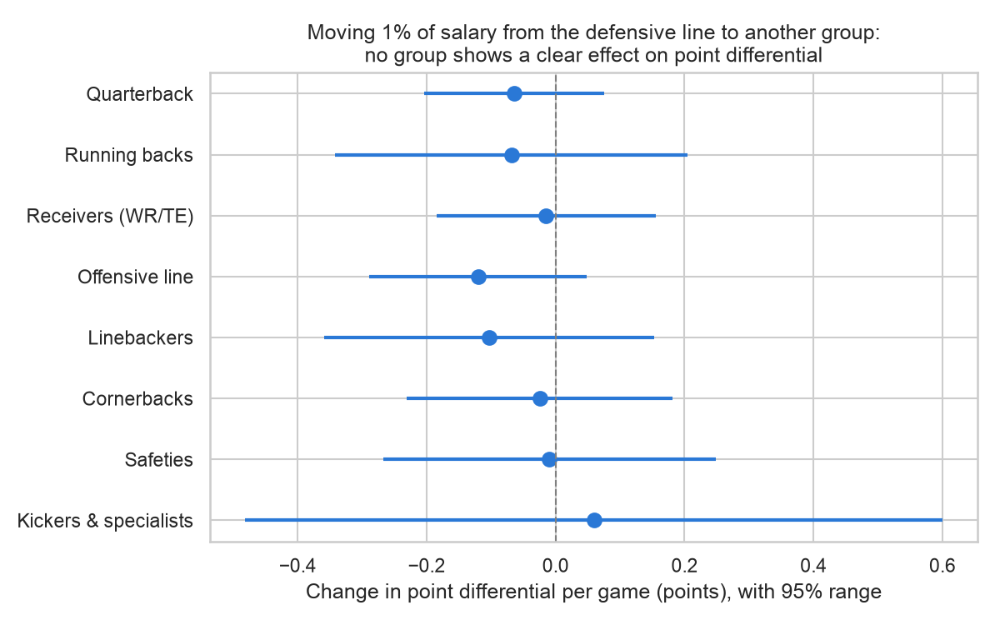

# NFL Salary Cap Allocation & Team Performance

Every NFL team gets the same salary budget each season (the salary cap). This project asks: **does how a team divides that budget across positions, and whether it pays one star or spreads money across a group, relate to how well it performs?**

**In two sentences:** Across 416 team-seasons (2013–2025), how a team split its salary budget explained almost none of the differences in how well teams played (under 3%). The clearest pattern was that teams relying on a quarterback still on his cheap first contract were outscored by about 1.5 points per game more than other teams, most likely because those teams were rebuilding.

## Why it matters
The salary cap is a fixed budget split across positions, much like an investor splitting capital across assets under a hard limit. This project tests whether allocation choices under a fixed constraint line up with outcomes.

## Definitions
| Term | Definition |
|---|---|
| Unit of analysis | One team in one regular season (32 teams × 13 seasons = 416 rows) |
| Salary measure | Each player's cap hit for that season. Dead money (charges for players no longer on the team) is left out. |
| Position groups | Quarterback, running backs, receivers (WR/TE), offensive line, defensive line, linebackers, cornerbacks, safeties, kickers & specialists |
| Spending share | A group's cap hits ÷ the team's total cap hits |
| Concentration | Highest-paid player's cap hit ÷ his group's total (receivers, offensive line, defensive line, linebackers, cornerbacks) |
| Rookie-contract QB | 1 if the team's main starting QB (most starts; ties go to the opening-day starter) was drafted within the last 4 seasons |
| Main outcome | Point differential per game (points scored minus points allowed, per game; seasons grew from 16 to 17 games in 2021) |
| Other outcomes | Win %, points scored per game, points allowed per game |

Other choices, all made before looking at results:
- Each player-season uses the position on the contract in effect that season.
- Relocated teams keep one name across the whole period (Raiders, Chargers, Rams).
- Washington is always the Commanders.

## Data
- **Game results:** nflverse schedules via [`nflreadpy`](https://github.com/nflverse/nflreadpy), regular season only.
- **Salaries:** nflverse contracts via `nflreadpy`, originally collected by [OverTheCap](https://overthecap.com). This gives each player's cap hit by season and team.
- **Draft years:** the nflverse players table via `nflreadpy`.

## Method
1. Build one row per team-season with spending shares, concentration and the rookie-QB flag (notebook §1–3).
2. Describe how teams split their budgets (§4), and correlate every measure with results (§5).
3. **Headline:** regress point differential per game on the spending shares (§6).
   - The defensive line, the biggest group, is left out as the baseline, because the shares always add up to 100%.
   - Each coefficient means "moving 1 percentage point of salary from the defensive line to this group".
   - Standard errors are clustered by team, since each franchise appears 13 times.
4. Supporting checks:
   - rookie-contract QB vs. not (§7);
   - one star vs. spread-out money (§8);
   - does this season's split predict *next* season? (§9);
   - offense spending vs. points scored and defense spending vs. points allowed (§10).

## Results

**1. No spending pattern lines up strongly with results.** Every correlation is between −0.12 and +0.08.



**2. Teams with a rookie-contract QB were outscored on average.** They averaged −0.9 points per game, against +0.6 for veteran-QB teams. In the regression this is −1.7 points per game (95% range −3.0 to −0.3), holding the budget split fixed. The next season, the gap disappears (+0.3, not significant), which fits the idea that these are rebuilding teams.



**3. Headline regression: moving money between groups shows no clear effect.**
- Every group's 95% range crosses zero.
- The spending shares plus the rookie-QB flag explain 2.8% of the differences in point differential (R² = 0.028).
- The joint test gives p = 0.42.



**Also:**
- **One star vs. spread-out money:** no pattern in any of the five groups (all correlations within ±0.07).
- **Next season:** this season's split doesn't predict next season's results (joint p = 0.47).
- **Offense and defense separately:** two weak signals point the sensible way. Spending more on the QB goes with scoring more (+0.14), and spending more on the defensive line goes with allowing fewer points (−0.11).

**A note on chance:** the notebook runs about 60 comparisons. At the 5% level, about 3 would look "significant" by luck alone. About 5–6 did, and several of those are the same rookie-QB result counted more than once. No single result here should be treated as a firm finding.

## Conclusion
Over 13 seasons, how an NFL team split its salary budget was only weakly associated with how well it played. Which positions got the money, and whether it went to one star or was spread around, didn't separate good teams from bad ones in any clear way. The strongest pattern was that teams relying on a quarterback on his cheap first contract were outscored more often, which likely reflects rebuilding teams rather than a cost of cheap quarterbacks. Overall, the evidence suggests that *how well* a team spends matters more than *where* it spends.

## Limitations
- **Association, not causation:** good teams may pay players *because* they won. The next-season check (§9) addresses this only partly.
- **Missing factors:** coaching, strategy and how good the quarterback is (beyond his contract type) are not controlled for.
- **Distorted cap hits:** restructured contracts, void years and dead money distort cap hits. Dead money is excluded, so team totals average about 86% of the league cap.
- **Injuries:** money paid to injured players never reaches the field.
- **Sample size:** the sample is small (416 rows), and team-seasons aren't fully independent. Clustering by team helps but doesn't fully fix this.
- **Prior work:** OverTheCap, PFF and FiveThirtyEight have studied positional spending. What this project adds is the concentration angle: one star vs. spreading money within a group.

## How to run
Requires Python 3.10+ (tested on 3.12).

```bash
python3 -m venv .venv
source .venv/bin/activate
pip install -r requirements.txt
jupyter notebook analysis.ipynb   # then Kernel → Restart & Run All
```

The notebook downloads all data on its first run and writes `data/processed/team_season.csv` and the charts in `charts/`.
